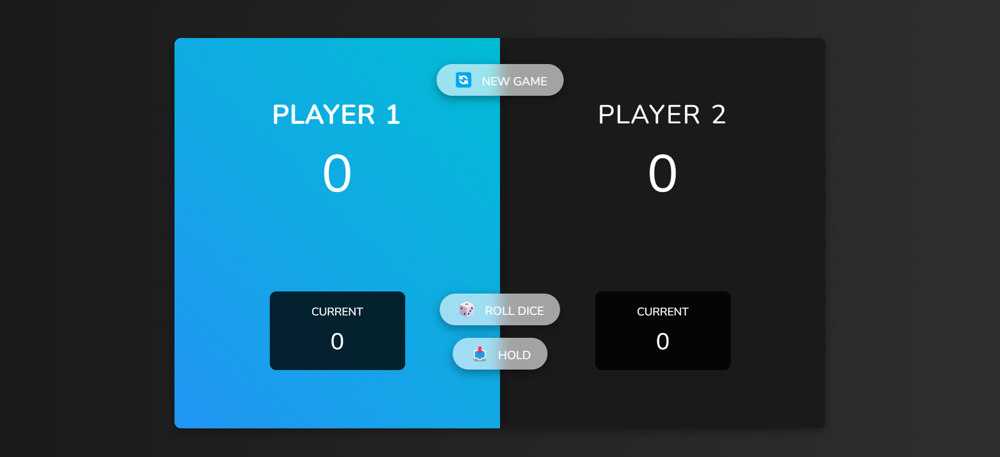

# Dicey Dash - Race to 100

Dicey Dash is a simple web-based dice game where two players compete to reach a total score of 100. It's a fun game of chance and strategy that you can play in your web browser. Roll the dice, accumulate points, and use your wits to decide when to "Hold" your score.

## Table of Contents

- [How to Play](#how-to-play)
- [Live Demo](#live-demo)
- [Getting Started](#getting-started)
- [Contributing](#contributing)
- [License](#license)

## How to Play

1. **Objective**: The goal of the game is to reach a total score of 100 points before your opponent.

2. **Game Rules**:

   - Two players take turns to roll a six-sided die.
   - If a player rolls a 1, their current score is lost, and it becomes the next player's turn.
   - A player can choose to "Hold" their current score, which adds it to their total score.
   - The first player to reach or exceed 100 points wins.

3. **Starting a New Game**:

   - Click the "New Game" button to start a new game at any time.

4. **Rolling the Dice**:

   - Click the "Roll Dice" button to roll the dice during your turn.

5. **Holding Your Score**:

   - Click the "Hold" button to add your current score to your total score and end your turn.

6. **Winning the Game**:
   - The player who reaches or exceeds 100 points first is declared the winner.

## Live Demo

You can try Dicey Dash right now! Play the game in your web browser by following this [Live Demo Link](https://Hamzeh01.github.io/dicey-dash/).

## Getting Started

To run this project locally or on your own web server, follow these steps:

1. **Clone the Repository**:

   - git clone https://github.com/Hamzeh01/dicey-dash.git
   - cd dicey-dash

2. **Open the Project**:

   - Open the `index.html` file in your web browser.

3. **Start Playing**:

   - Follow the on-screen instructions to play the game.

## Contributing

Contributions are welcome! If you'd like to enhance the game or fix any issues, please:

1. Fork the project.
2. Create your feature branch (`git checkout -b feature/AmazingFeature`).
3. Commit your changes (`git commit -m 'Add some AmazingFeature'`).
4. Push to the branch (`git push origin feature/AmazingFeature`).
5. Open a pull request.

## License

This project is licensed under the MIT License - see the [LICENSE](LICENSE.txt) file for details.

---

Enjoy playing Dicey Dash! If you have any questions or suggestions, please feel free to [open an issue](https://github.com/Hamzeh01/dicey-dash/issues).
